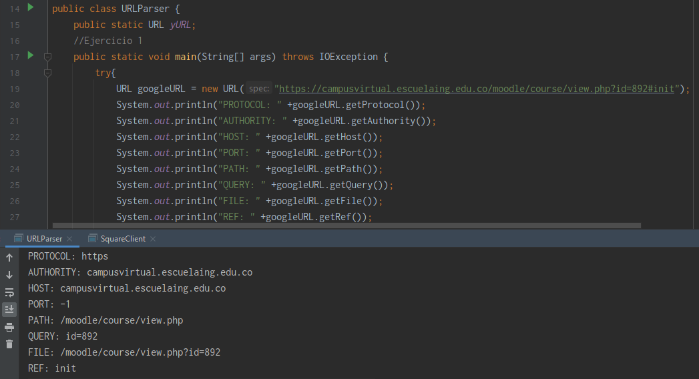
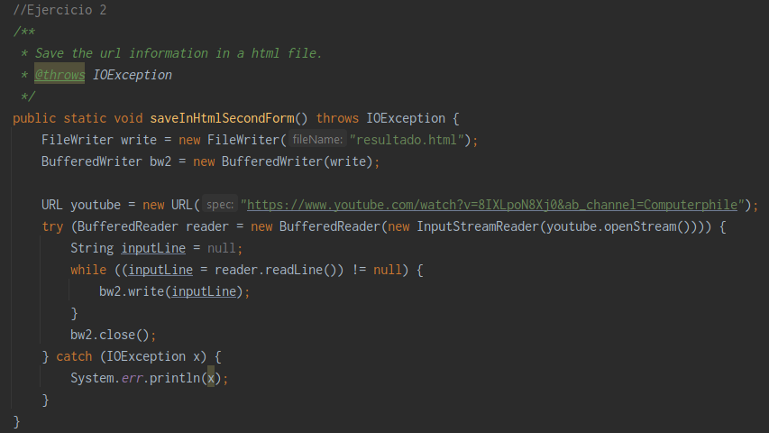
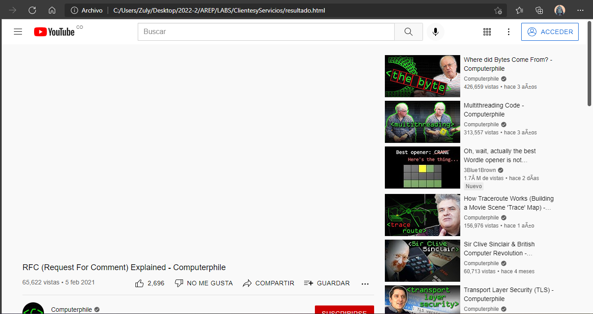
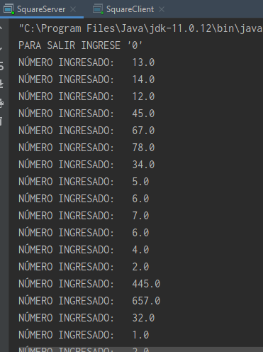
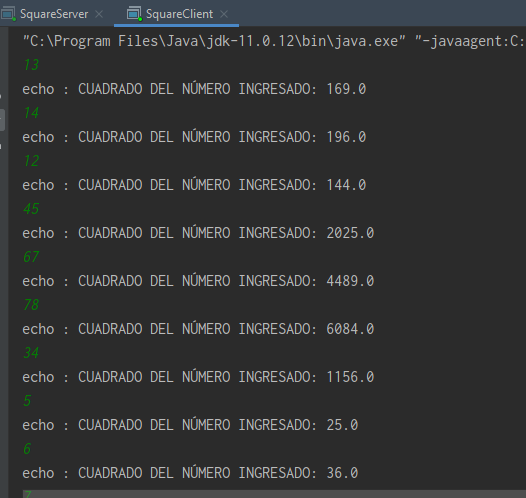

# TALLER CLIENTES Y SERVICIOS

Este taller presenta diferentes retos y ejercicios que ayudaran a explorar los conceptos de esquemas de nombres y de clientes y servicios. Adicionalmente, el taller le ayudará a explorar la arquitectura de las aplicaciones distribuidas sobre internet.

## Cómo empezar

A continuación podrá encontrar los pasos ccon los cuales puede acceder al sitio web o usar el proyecto de manera local.

### Prerrequisitos

* [Maven](https://maven.apache.org/) - Administrador de dependencias
* [Java ](https://www.oracle.com/co/java/technologies/javase/javase-jdk8-downloads.html)       Ambiente de desarrollo
* [Git](https://git-scm.com/) - Sistema de control de versiones

### Instalación

Para descargar el proyecto ejecute 

   https://github.com/ZulyVargas/AREP_ClientesyServicios.git

## Documentación
Para generar la documentación se debe ejecutar:

    mvn javadoc:javadoc

Esta quedará en la carpeta target/site/apidocs :

O diríjase a la siguiente dirección: 
* [Documentación](https://github.com/ZulyVargas/AREP_ClientesyServicios/blob/master/javadocs/index.html)

## Construido con 

* [Maven](https://maven.apache.org/) - Administrador de dependencias
* [Heroku](https://heroku.com) - Plataforma de despliegue

## Ejercicio 1 

 Programa en el cual se imprime en pantalla cada uno de los componentes de una URL. 

 

## Ejercicio 2

Programa en el cual se guarda la información de un url en un archivo "resultado.html". Al ejecutar el programa se puede ver que el archivo queda almacenado en la carpeta raíz del proyecto.

 

Para este caso se cargó la url de un vídeo en Youtube. Al abrir el archivo en el navegador se carga su archivo html :

 

 ## Ejercicio 3 

Programa que cuenta con un servidor que retorna el cuadrado de un número ingresado. Para probar su funcionamiento se debe ejecutar inicialmente el programa en SquareServer y posteriormente el SquareCLient:

 

Resultados retornados:

 
## Autores

**Zuly Valentina Vargas Ramírez** 

## Licencia

Este proyecto esta bajo la licencia GNU(General Public License) los detalles se encuentran en el archivo [LICENSE](LICENSE.txt).
